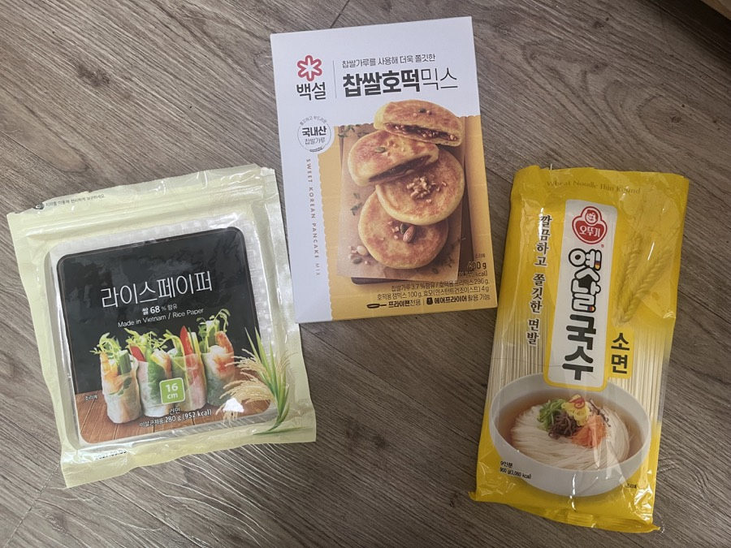
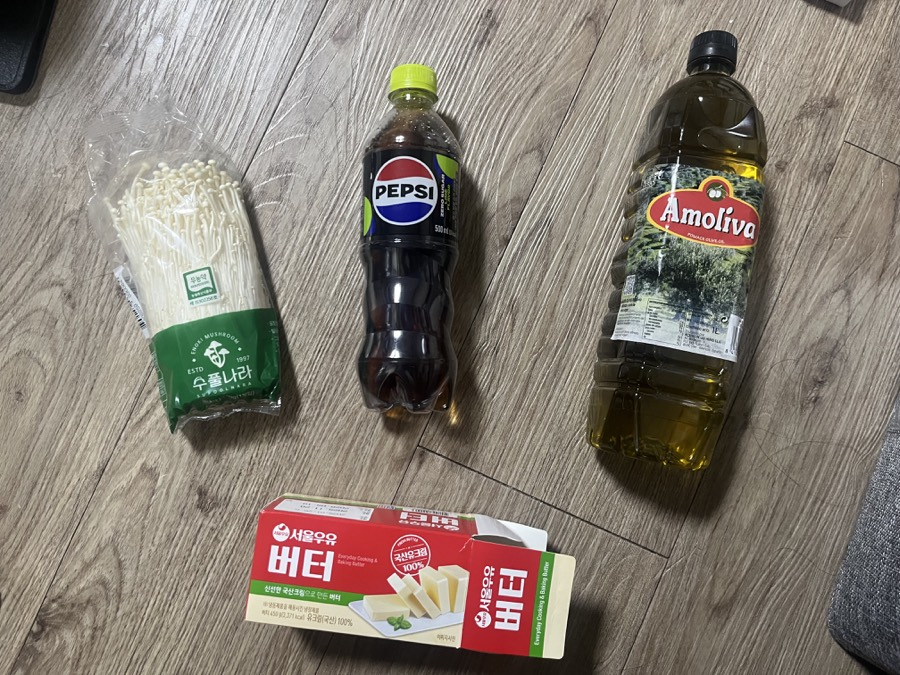
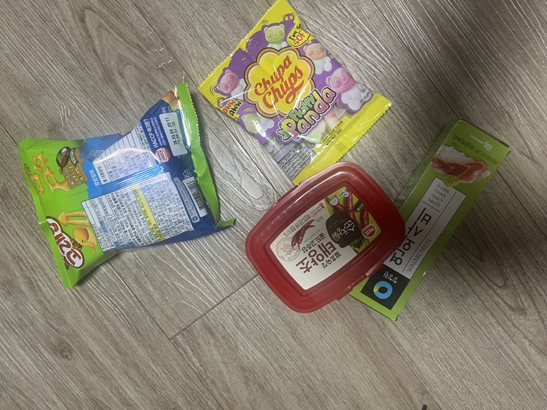
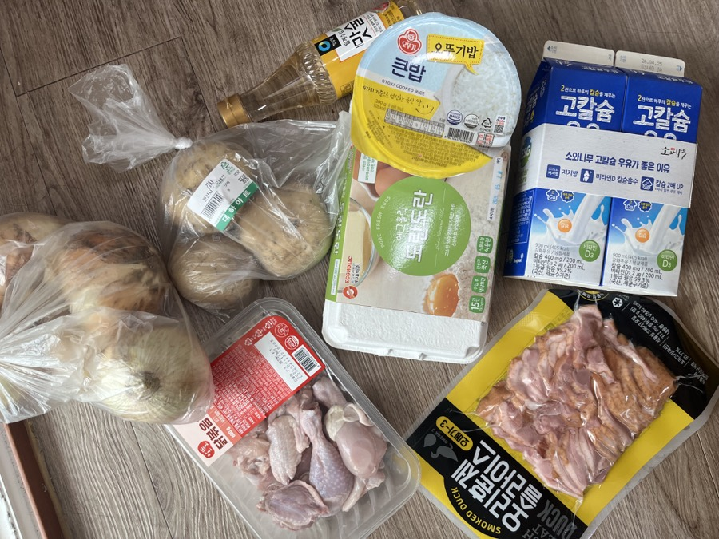
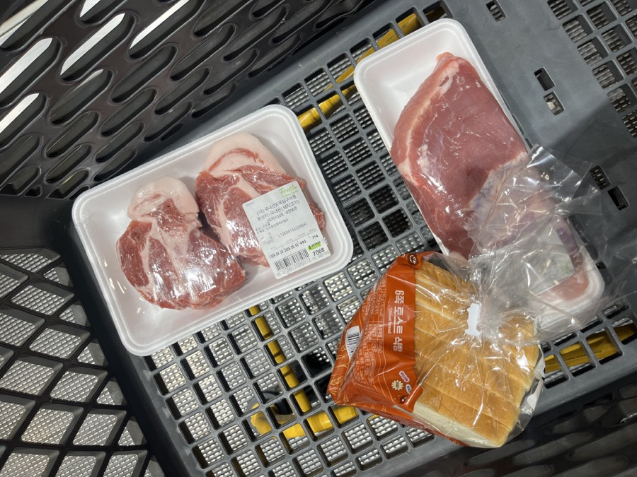
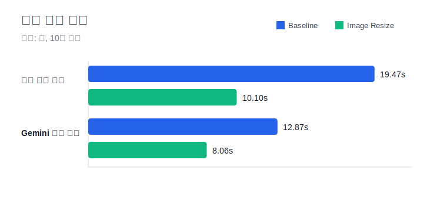
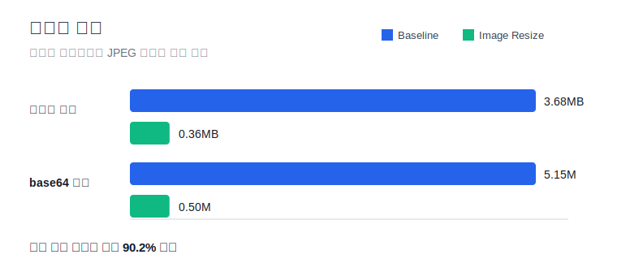
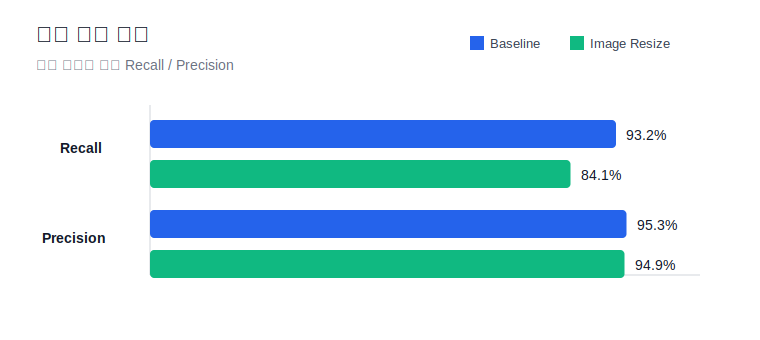

# 성능 개선 사항

FreshKeep의 AI 식재료 분석 기능은 사진을 기반으로 식재료 목록과 소비기한을 추론하는 핵심 기능입니다. 초기 구현에서는 원본 이미지를 그대로 Gemini API 요청에 포함했기 때문에, 실제 기기 테스트에서 분석 완료까지 평균 19.47초가 걸렸습니다.

사용자가 사진을 촬영한 뒤 결과를 기다리는 흐름에서 20초에 가까운 대기 시간은 부담이 크다고 판단했고, 이미지 전송량을 줄이는 방식으로 성능 개선을 진행했습니다.

## 개선 목표

- 이미지 분석 완료 시간 단축
- Gemini API 호출 시간 단축
- 전송 이미지 크기 감소
- 식재료 감지 정확도 변화 확인

## 실험 조건

| 항목 | 내용 |
| --- | --- |
| 모델 | `gemini-2.5-flash` |
| 테스트 이미지 | 식재료 사진 5장 |
| 반복 횟수 | 사진당 2회, 단계별 총 10회 |
| 측정 환경 | 동일한 iPhone과 네트워크 환경 |
| 측정 항목 | 전체 분석 시간, Gemini 호출 시간, 이미지 크기, base64 길이, Recall, Precision |

## 테스트 이미지

| Photo 1 | Photo 2 | Photo 3 |
| --- | --- | --- |
|  |  |  |
| 라이스페이퍼, 찹쌀호떡믹스, 소면 | 팽이버섯, 콜라, 올리브유, 버터 | 츄파춥스젤리, 고래밥과자, 고추장, 와사비 |

| Photo 4 | Photo 5 |
| --- | --- |
|  |  |
| 양파, 감자, 맛술, 햇반, 계란, 우유, 닭고기, 오리고기 | 돼지고기 목살, 돼지고기 앞다리, 식빵 |

## 적용한 개선

Gemini 요청 전 이미지를 전처리하도록 변경했습니다.

| 항목 | 개선 전 | 개선 후 |
| --- | --- | --- |
| 이미지 크기 | 원본 이미지 | 최대 변 1280px |
| JPEG 품질 | 0.8 | 0.65 |
| JSON 응답 방식 | Prompt only | Prompt only |

이번 실험에서는 이미지 리사이징과 압축률 변경 효과만 확인하기 위해, JSON Schema 적용은 제외했습니다.

## 측정 결과 요약

| 지표 | 개선 전 | 개선 후 | 변화 |
| --- | ---: | ---: | ---: |
| 평균 전체 분석 시간 | 19.47초 | 10.10초 | 48.1% 단축 |
| 중앙값 전체 분석 시간 | 21.76초 | 10.02초 | 53.9% 단축 |
| 평균 Gemini API 호출 시간 | 12.87초 | 8.06초 | 37.3% 단축 |
| 평균 전송 이미지 크기 | 3.68MB | 0.36MB | 90.2% 감소 |
| 평균 base64 길이 | 5,151,717자 | 503,123자 | 90.2% 감소 |
| 성공률 | 100% | 100% | 유지 |
| Recall | 93.2% | 84.1% | 9.1%p 감소 |
| Precision | 95.3% | 94.9% | 0.4%p 감소 |

## 측정 결과 그래프

### 분석 시간

### 전송량

### 감지 품질

## Baseline Runs

원본 이미지와 JPEG 0.8 조건에서 측정한 결과입니다.

| Run | Photo | Detected Items | Correct | Missing | False Positive | Client Total | Gemini | Image Size | Notes |
| --- | --- | --- | ---: | ---: | ---: | ---: | ---: | ---: | --- |
| B-01 | Photo 1 | 라이스페이퍼, 찹쌀호떡믹스, 소면 | 3 | 0 | 0 | 21.40s | 12.27s | 3.73MB | - |
| B-02 | Photo 1 | 라이스페이퍼, 참쌀호떡믹스, 소면 | 3 | 0 | 0 | 15.88s | 8.85s | 3.73MB | 표기 차이 |
| B-03 | Photo 2 | 버터, 팽이버섯, 펩시, 올리브 오일 | 4 | 0 | 0 | 24.90s | 14.74s | 3.91MB | 펩시는 콜라로 처리 |
| B-04 | Photo 2 | 버터, 팽이버섯, 펩시 제로 슈거, 올리브 오일 | 4 | 0 | 0 | 13.38s | 8.24s | 3.91MB | 펩시는 콜라로 처리 |
| B-05 | Photo 3 | 고래밥, 태양초 고추장, 와사비 페이스트, 츄파춥스 젤리 | 4 | 0 | 0 | 22.92s | 14.80s | 4.31MB | - |
| B-06 | Photo 3 | 고래밥, 고추장, 와사비 페이스트, 츄파춥스 젤리 | 4 | 0 | 0 | 25.00s | 20.21s | 4.31MB | - |
| B-07 | Photo 4 | 양파, 생닭고기, 감자, 요리 식초, 훈제 오리, 계란, 즉석밥, 우유 | 7 | 1 | 1 | 22.11s | 16.30s | 3.54MB | 맛술을 요리 식초로 오인식 |
| B-08 | Photo 4 | 양파, 생닭고기, 감자, 맛술, 훈제 오리, 계란, 즉석밥, 멸균우유 | 8 | 0 | 0 | 25.39s | 20.61s | 3.54MB | 멸균우유는 우유로 처리 |
| B-09 | Photo 5 | 돼지고기 목살, 돼지고기 안심, 식빵 | 2 | 1 | 1 | 12.11s | 5.47s | 2.93MB | 앞다리를 안심으로 오인식 |
| B-10 | Photo 5 | 돼지고기, 식빵 | 2 | 1 | 0 | 11.64s | 7.19s | 2.93MB | 돼지고기 두 부위를 하나로 감지 |

## Image Resize Runs

최대 변 1280px와 JPEG 0.65 조건에서 측정한 결과입니다.

| Run | Photo | Detected Items | Correct | Missing | False Positive | Client Total | Gemini | Image Size | Notes |
| --- | --- | --- | ---: | ---: | ---: | ---: | ---: | ---: | --- |
| I-01 | Photo 1 | 라이스페이퍼, 찹쌀호떡믹스, 소면 | 3 | 0 | 0 | 7.59s | 5.99s | 0.34MB | - |
| I-02 | Photo 1 | 찹쌀호떡믹스, 라이스페이퍼, 소면 | 3 | 0 | 0 | 9.43s | 8.35s | 0.34MB | - |
| I-03 | Photo 2 | 버터, 팽이버섯, 펩시 제로 슈거, 올리브 오일 | 4 | 0 | 0 | 10.94s | 9.45s | 0.39MB | 펩시는 콜라로 처리 |
| I-04 | Photo 2 | 팽이버섯, 버터, 펩시 제로 슈거, 올리브 오일 | 4 | 0 | 0 | 8.79s | 7.59s | 0.39MB | 펩시는 콜라로 처리 |
| I-05 | Photo 3 | 꼬깔콘, 고추장, 와사비 페이스트, 츄파춥스 젤리 | 3 | 1 | 1 | 14.76s | 13.41s | 0.39MB | 고래밥을 꼬깔콘으로 오인식 |
| I-06 | Photo 3 | 고래밥, 고추장, 와사비 페이스트, 츄파춥스 젤리 | 4 | 0 | 0 | 10.61s | 9.43s | 0.39MB | - |
| I-07 | Photo 4 | 양파, 닭고기, 마, 맛술, 계란, 즉석밥, 우유, 훈제 오리 | 7 | 1 | 1 | 12.99s | 9.90s | 0.35MB | 감자를 마로 오인식 |
| I-08 | Photo 4 | 양파, 생닭고기, 마, 계란, 맛술, 즉석밥, 오리훈제, 우유 | 7 | 1 | 1 | 13.79s | 6.83s | 0.35MB | 감자를 마로 오인식, 재시도 후 성공 |
| I-09 | Photo 5 | 돼지고기 목살, 식빵, 돼지고기 등심 | 2 | 1 | 1 | 6.82s | 5.20s | 0.33MB | 앞다리를 등심으로 오인식 |
| I-10 | Photo 5 | 돼지고기 앞다리살, 돼지고기, 식빵 | 3 | 0 | 0 | 5.31s | 4.49s | 0.33MB | 목살은 세부 부위 없이 감지 |

## 결과 해석

이미지 리사이징과 JPEG 압축률 변경만으로 평균 전송 이미지 크기를 약 90.2% 줄였고, 전체 분석 시간은 평균 19.47초에서 10.10초로 약 48.1% 단축했습니다. Gemini API 호출 시간도 평균 12.87초에서 8.06초로 약 37.3% 줄었습니다.

다만 감지 정확도에는 일부 trade-off가 있었습니다. 특히 `감자`를 `마`로 오인식하거나, 과자/돼지고기 부위처럼 세부 구분이 필요한 항목에서 누락 또는 오인식이 발생했습니다. 따라서 이미지 최적화는 속도 개선에는 효과적이지만, 식재료 감지 품질을 함께 검증하며 적용해야 한다는 점을 확인했습니다.

## 배운 점

이번 개선을 통해 기능 구현 이후에도 실제 사용 흐름에서 병목을 측정하고, 개선 효과를 수치로 검증하는 과정의 중요성을 배웠습니다. 단순히 “빨라졌다”가 아니라 어떤 변경이 어느 정도의 시간 단축을 만들었고, 그 과정에서 어떤 정확도 손실이 있었는지 함께 판단하는 경험이었습니다.

향후에는 JSON Schema 기반 응답 구조화까지 적용하여 파싱 안정성을 높이고, 이미지 최적화로 하락한 Recall을 보완할 수 있는지 추가로 검증할 계획입니다.
